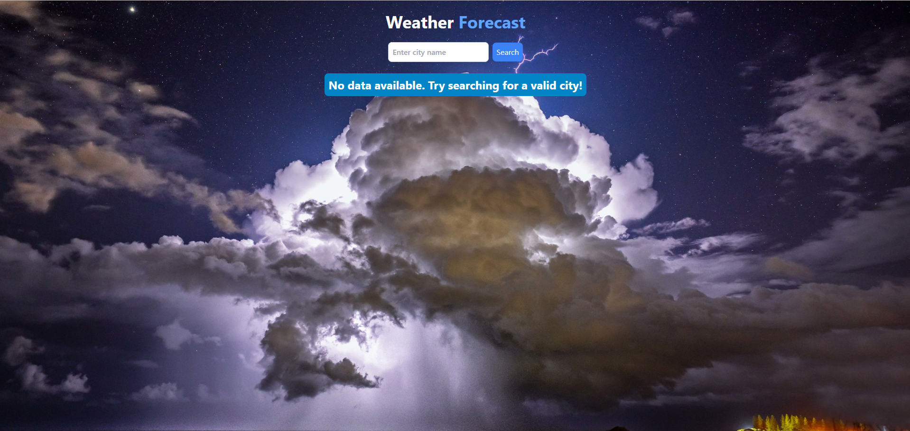
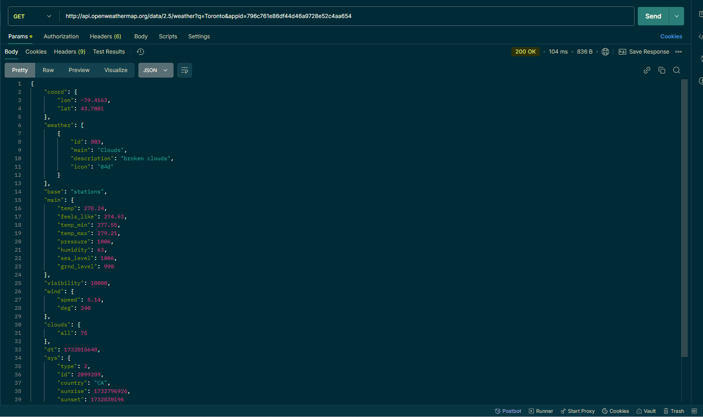

# Weather Forecast App

Welcome to the **Weather Forecast App**! This is a React-based application that provides real-time weather data and a 5-day forecast for cities around the world using the **OpenWeather API**.

## Features

- **Search for Weather**: Enter any city name to get current weather and forecast data.
- **Current Weather Data**: Displays temperature, humidity, wind speed, air pressure, and weather description.
- **5-Day Forecast**: Shows a 5-day weather forecast with temperature and weather icons.
- **Beautiful Design**: The app is styled using **Tailwind CSS** and includes weather-related images as backgrounds to enhance the user experience.

## Technologies Used

- **React**: JavaScript library for building user interfaces.
- **Tailwind CSS**: A utility-first CSS framework for styling.
- **Axios**: Promise-based HTTP client for making API requests.
- **OpenWeather API**: A popular API that provides weather data.

## Installation

To get started with the project, follow these steps:

1. **Clone the repository**:
   ```bash
   git clone https://github.com/your-username/weather-forecast-app.git```

**Navigate to the project directory**:

```cd weather-forecast-app```

**Install dependencies**:

```npm install```

**Start the app**:


```npm start```

This will run the app in development mode. Open http://localhost:3000 in your browser to view the app.

**API Key Setup**
This app requires an API key from OpenWeather to fetch weather data.

- Go to OpenWeather and sign up to get your API key.
- Replace the API key in the code:
- In Weather.js and App.js, locate the API_KEY variable and insert your key like this:
    ```const API_KEY = 'your_api_key_here';```

### Project Structure

**The project is structured as follows**:

/weather-forecast-app
│
├── /public
│   └── index.html
├── /src
│   ├── /assets
│   │   ├── weather2.jpg
│   │   └── weather.jpg
│   ├── /components
│   │   └── Weather.js
│   ├── App.js
│   ├── index.js
│   └── tailwind.config.js
└── package.json

**Key Files**:

App.js: The main component that handles state management and data fetching.
Weather.js: The component responsible for displaying weather data and the 5-day forecast.
tailwind.config.js: Configuration file for Tailwind CSS.

## How It Works

**App.js**

**State Variables**:

city: The current city name entered by the user.
weatherData: Stores the current weather data fetched from the OpenWeather API.
forecastData: Stores the 5-day weather forecast data.
loading: Indicates whether data is being fetched.

**retrieveWeatherData function**:

This function fetches current weather data and the 5-day forecast data from the OpenWeather API.
It updates the state with the fetched data.
If an error occurs, it logs the error and ensures that the loading state is set to false.
handleSearch function:

This function is called when the user clicks the search button or presses Enter after typing a city name.

## Weather.js

This component is responsible for displaying the UI elements.
The user can search for a city, and the component displays the weather and forecast data.
If data is being fetched, a loading message is shown.
If no valid data is found, a message prompts the user to try a different city.

**Props**:
city: The current city being searched.
weatherData: Current weather data fetched from OpenWeather.
forecastData: The 5-day weather forecast data.
loading: Boolean flag to indicate if data is loading.
handleSearch: A function passed down from App.js to handle the search logic.
setCity: Function to update the city state in App.js.

## Screenshots



At this screenshot we can see the initial screen with the search bar. It doesn't display any data, since there was not requested the search for a city


This screenshot illustrates the weather result based on the requested city.



This screenshot illustrates the result retrieved after sending the request in Postman


## License

This project is licensed under the MIT License - see the LICENSE file for details.

## Acknowledgements

OpenWeather API: For providing reliable and free weather data.
Tailwind CSS: For easy and fast styling.
React: For building interactive UIs.